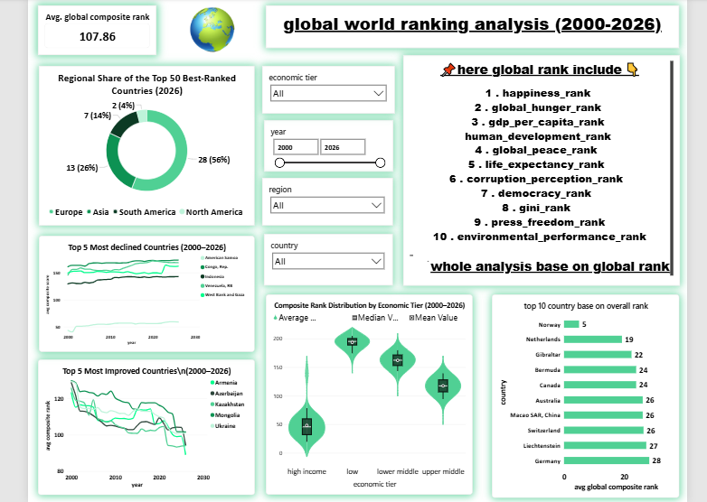

# 🌍 Global Country Rankings Analysis

An end-to-end **Data Analytics project** analyzing the relative performance of **217 sovereign nations from 2000 to 2026** across 11 international ranking dimensions.

The project combines **Python-based data cleaning and exploratory data analysis (EDA)** with an interactive **Power BI dashboard** to study global development, governance, economic, social, peace, press freedom, and environmental performance over time.

---

## 📌 Project Overview

Countries are evaluated annually using 11 ranking dimensions, where:

> **1 = Best Rank | 217 = Worst Rank**

The analysis covers **5,859 country-year observations**:

- **217 countries**
- **27 years (2000–2026)**
- **11 ranking indicators**
- Regional and economic-tier classifications

The project also introduces a **Composite Rank**, calculated as the arithmetic mean of the 11 individual ranking dimensions. This provides a single overall measure that can be used to compare countries and evaluate changes over time.

---

## 🎯 Project Objectives

The main objectives of this project are to:

- Analyze country performance across multiple global indicators.
- Study how country rankings change between **2000 and 2026**.
- Compare countries across regions and economic tiers.
- Identify the **top-ranked countries** based on the composite rank.
- Identify countries showing the greatest improvement or decline.
- Explore relationships between economic development, human development, happiness, peace, and other dimensions.
- Build an interactive Power BI dashboard for executive-level exploration.

---

## 📊 Ranking Dimensions

The dataset contains the following 11 ranking indicators:

| Indicator | Description |
|---|---|
| Happiness Rank | Relative country ranking for happiness |
| Global Hunger Rank | Relative ranking for hunger/nutrition conditions |
| Human Development Rank | Relative human development ranking |
| GDP Per Capita Rank | Relative ranking based on GDP per capita |
| Life Expectancy Rank | Relative ranking for life expectancy |
| Corruption Perception Rank | Relative ranking for perceived corruption |
| Democracy Rank | Relative democracy ranking |
| Gini Rank | Relative ranking associated with income inequality |
| Press Freedom Rank | Relative press freedom ranking |
| Global Peace Rank | Relative peace and safety ranking |
| Environmental Performance Rank | Relative environmental performance ranking |

### Composite Rank

The project calculates:

```text
Composite Rank =
Average of the 11 ranking dimensions
```

A lower composite rank represents better overall relative performance.

---

## 🔎 Key Analysis Performed

### 1. Data Validation

The data-cleaning workflow validates the panel structure by checking:

- Number of unique countries per year
- Number of years available for each country
- Ranking columns and their distributions
- Data types and dataset structure

The resulting dataset contains a consistent **2000–2026 country-year panel**.

### 2. Correlation Analysis

A correlation heatmap is used to investigate relationships between the numerical ranking dimensions.

This helps explore relationships such as:

- Human Development vs GDP Per Capita
- Happiness vs Global Peace
- Economic performance vs broader development indicators

### 3. 2026 Country Ranking

The project identifies the **Top 10 countries in 2026** based on the lowest composite rank.

### 4. Country Improvement & Decline

Country-level composite ranks from **2000 vs 2026** are compared to identify:

- Top 5 most improved countries
- Top 5 most declined countries

### 5. Regional Analysis

Composite rank distributions are compared across regions to understand differences in overall country performance.

### 6. Economic Tier Analysis

Countries are also compared across economic tiers:

- High Income
- Upper Middle Income
- Lower Middle Income
- Low Income

### 7. Distribution Analysis

The distribution of composite ranks across all 217 countries in 2026 is analyzed using:

- Histogram
- Mean
- Median

### 8. Regional Share of Top-Ranked Countries

The project analyzes the regional composition of the highest-ranked countries in 2026.

---

## 📈 Power BI Dashboard

The Power BI component converts the analytical findings into an interactive dashboard for exploring:

- Country rankings
- Composite performance
- Regional comparisons
- Economic-tier comparisons
- Historical trends
- Country-level performance

### Dashboard Preview



---

## 🛠️ Tools & Technologies

### Programming & Analysis
- Python
- Pandas
- NumPy
- Matplotlib
- Seaborn
- Jupyter Notebook

### Business Intelligence
- Microsoft Power BI
- Data Modeling
- Interactive Visualizations

### Data Analysis Techniques
- Data Cleaning
- Data Validation
- Exploratory Data Analysis
- Correlation Analysis
- Ranking Analysis
- Time-Series Analysis
- Comparative Analysis
- Distribution Analysis

---

## 📂 Project Structure

```text
global_country_rank/
│
├── global_country_rankings.csv
├── clean_dataset.csv
│
├── data_clean.ipynb
├── EDA.ipynb
│
├── global_country_rank_analysis.pbix
├── global_country_rank_analysis.png
│
├── Distribution of Composite Rank by Region and Economic Tier 20002026.png
├── Distribution of Composite Score Across Countries .png
├── Regional Share of the Best-Ranked Countries .png
├── top 10 country base on composite rank.png
├── top 5 most improved_declined country.png
├── happimess vs global pece rank.png
├── human_development vs gdp_capital rank.png
│
├── logo.png
└── requirement.txt
```

---

## ⚙️ Data Cleaning Workflow

The project starts with the raw country-ranking dataset and prepares it for analysis.

### Main steps

1. Load the raw CSV dataset.
2. Validate country and year coverage.
3. Verify the number of countries per year.
4. Check the number of years available per country.
5. Review ranking columns.
6. Standardize column names.
7. Convert the economic tier into descriptive categories.
8. Create the cleaned dataset.
9. Perform EDA and statistical analysis.
10. Use the prepared data for Power BI reporting.

---

## 🧮 Composite Rank Methodology

The composite rank is calculated using the mean of the 11 ranking dimensions:

```python
ranked_columns = [
    'happiness_rank',
    'global_hunger_rank',
    'gdp_per_capita_rank',
    'human_development_rank',
    'global_peace_rank',
    'life_expectancy_rank',
    'corruption_perception_rank',
    'democracy_rank',
    'gini_rank',
    'press_freedom_rank',
    'environmental_performance_rank'
]

df['composit_rank'] = (
    df[ranked_columns]
    .mean(axis=1)
    .round(2)
)
```

### Interpretation

Because every indicator follows the same direction:

```text
Lower Rank → Better Performance
Higher Rank → Worse Performance
```

Therefore:

```text
Lower Composite Rank → Better Overall Relative Performance
```

> **Note:** The composite rank is an analytical summary created for this project. It uses an unweighted arithmetic average, so it should be interpreted as a comparative analytical metric rather than an official global ranking.

---

## 📚 Data Sources

The project documentation describes the dataset as integrating international indicators and benchmark indices associated with organizations including:

- World Bank
- United Nations Development Programme (UNDP)
- Transparency International
- Economist Intelligence Unit (EIU)
- Reporters Without Borders (RSF)
- Institute for Economics & Peace (IEP)
- Yale Environmental Performance Index (EPI)

The project uses the consolidated dataset included in this repository for analysis.

---

## 🚀 Getting Started

### Prerequisites

Make sure you have:

- Python 3.x
- Git
- Jupyter Notebook or JupyterLab
- Power BI Desktop (optional, for opening the `.pbix` file)

The project includes a `requirement.txt` file with the Python package versions used during development.

---

## 🔗 Clone the Repository

Clone the complete Power BI repository:

```bash
git clone https://github.com/Ishasavani1402/Data-Analytics/tree/main/DA_python_projects/global_country_rank
```

Move into the repository:

```bash
cd powerBi
```

Then navigate to the project folder:

```bash
cd global_country_rank
```

> If the project folder name in your GitHub repository uses different capitalization or spacing, use the exact folder name shown in the repository.

---

## 📦 Install Python Dependencies

Create a virtual environment:

### Windows

```bash
python -m venv venv
venv\Scripts\activate
```

### macOS / Linux

```bash
python3 -m venv venv
source venv/bin/activate
```

Install the required packages:

```bash
pip install -r requirement.txt
```

---

## ▶️ Run the Analysis

Start Jupyter Notebook:

```bash
jupyter notebook
```

Then open:

```text
data_clean.ipynb
```

for the cleaning and validation workflow.

After that, open:

```text
EDA.ipynb
```

to reproduce the exploratory analysis and visualizations.

---

## 📊 Open the Power BI Dashboard

To explore the interactive dashboard:

1. Install **Power BI Desktop**.
2. Open:

```text
global_country_rank_analysis.pbix
```

3. Use the available filters and visualizations to explore country-level and regional performance.

---

## 💡 Business & Analytical Questions

This project can be used to answer questions such as:

- Which countries have the strongest overall ranking?
- Which countries improved the most between 2000 and 2026?
- Which countries experienced the greatest decline?
- How does composite performance differ across regions?
- How does economic tier relate to overall country performance?
- Is higher GDP-per-capita performance associated with stronger human development?
- Is there a relationship between peace and happiness rankings?
- How is the top-ranked country group distributed across regions?

---

## 📌 Key Learning Outcomes

Through this project, I strengthened my ability to:

- Work with multi-year panel data.
- Validate large structured datasets.
- Perform systematic data cleaning.
- Conduct exploratory and correlation analysis.
- Create composite analytical metrics.
- Perform country, regional, and economic-tier comparisons.
- Build time-series analyses.
- Translate analytical findings into interactive Power BI dashboards.
- Communicate complex multi-dimensional data through visual storytelling.

---

## ⚠️ Important Considerations

The composite rank is designed for **analytical comparison within this project**.

It should not be interpreted as an official global country ranking because:

- The underlying indices may use different methodologies.
- The indicators may not have identical statistical properties.
- All 11 dimensions are given equal weight in the composite calculation.
- Missing values, source methodology changes, or differences in index construction can affect longitudinal comparisons.

---

## 👤 Author

**Isha Savani**

Data Analytics | Python | SQL | Power BI

GitHub:  
https://github.com/Ishasavani1402

---

## ⭐ If You Find This Project Useful

If you find this project useful for learning or portfolio reference, consider giving the repository a ⭐ on GitHub.

Feedback and suggestions are welcome!
