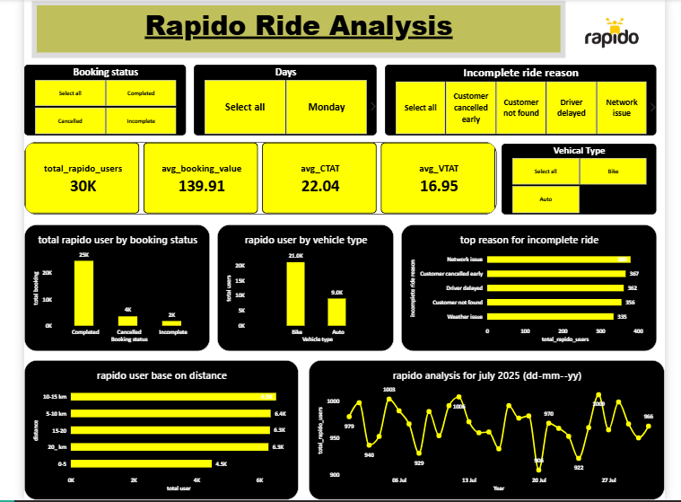

# 🛵 Rapido Ride-Hailing Operations Analysis — July 2025

> **End-to-end data analytics project** on a simulated Rapido ride-hailing dataset covering 30,000 bookings across July 2025. The project spans data ingestion, cleaning, exploratory analysis, and an interactive Power BI dashboard — built with Python, MySQL, and Power BI.

---

## 📌 Project Overview

Rapido is one of India's largest bike-taxi and auto-rickshaw platforms. This project simulates the work of a **data analyst at a ride-hailing company** — answering real operational questions around booking conversion, driver performance, revenue leakage, and early churn signals using a structured analytics pipeline.

**Dataset period:** July 2025 | **Records:** 30,000 bookings | **Cities:** Delhi, Mumbai, Bengaluru, Hyderabad, Chennai, Pune

---

## 🗂️ Project Structure

```
Rapido_analysis/
│
├── rapido_july2025_data.csv        # Raw simulated dataset (30,000 records)
├── csv_mysql.py                    # Script to ingest CSV into MySQL
├── data_clean.ipynb                # Data cleaning & feature engineering notebook
├── EDA.ipynb                       # Exploratory analysis notebook (28 business questions)
├── rapido_analysis_dashboard.pbix  # Power BI dashboard file
├── rapido_analysis_dashboard.png   # Dashboard preview
└── .env                            # DB credentials (not committed)
```

---

## 🔧 Tech Stack

| Layer | Tools |
|---|---|
| Data Storage | MySQL |
| Ingestion | Python · `mysql-connector-python` · `pandas` |
| Cleaning & EDA | Python · `pandas` · `numpy` · `sqlalchemy` · `seaborn` · `matplotlib` · `scipy` |
| Dashboard | Power BI Desktop |
| Environment | `python-dotenv` for credential management |

---

## 🗃️ Dataset Schema

| Column | Description |
|---|---|
| `Booking_ID` | Unique ride identifier |
| `Booking_Status` | Completed / Cancelled / Incomplete |
| `Booking_Value` | Fare quoted for the ride (₹) |
| `Customer_ID` / `Driver_ID` | Anonymized IDs |
| `Pickup_Location` / `Drop_Location` | City-level origin and destination |
| `Ride_Distance(km)` | Trip distance |
| `Ride_Time(min)` | Trip duration |
| `Date` / `Time` | Booking timestamp |
| `Vehicle_Type` | Bike / Auto |
| `Payment_Method` | UPI / Cash / Card / Wallet |
| `Customer_Rating` / `Driver_Rating` | Post-ride ratings (1–5) |
| `Canceled_Rides_by_Customer` / `_by_Driver` | Cancellation flags |
| `Incomplete_Rides` / `Incomplete_Rides_Reason` | Failure flags and reasons |
| `Total_Bookings` / `Canceled_Bookings` / `Canceled_Percentage` | Driver-level aggregated metrics |
| `V_TAT` | Vehicle arrival time (minutes) |
| `C_TAT` | Customer wait/prep time (minutes) |

---

## ⚙️ Pipeline Walkthrough

### Step 1 — Ingest Raw CSV into MySQL (`csv_mysql.py`)

- Connects to MySQL via environment variables (no hardcoded credentials)
- Auto-infers column types: uses `DECIMAL(10,2)` for rating and distance columns to prevent floating-point rounding errors
- Inserts data in **1,000-row chunks** for memory efficiency
- Handles `NULL` vs empty string distinction correctly before insert

```bash
# Run ingestion
python csv_mysql.py rapido_july2025_data.csv
```

> ⚠️ Credentials are loaded from `.env` — never committed to version control.

---

### Step 2 — Data Cleaning (`data_clean.ipynb`)

Reads raw table from MySQL, applies the following transformations, and saves a `clean_dataset` table back to MySQL:

| Action | Detail |
|---|---|
| Dropped irrelevant columns | `Vehicle_Image`, `Booking_ID`, `Customer_ID`, `Driver_ID` |
| Standardized null-like values | Empty strings in `Incomplete_Rides_Reason` → `"Ride Complete"` |
| Date/time feature engineering | Extracted `hour`, `day`, `day_name`, `current_date_` from `Date` and `Time` |
| Whitespace cleanup | Stripped leading/trailing spaces from all string columns |
| Verified row integrity | Row count in MySQL matched in-memory DataFrame before proceeding |

---

### Step 3 — Exploratory Data Analysis (`EDA.ipynb`)

All queries run against the `clean_dataset` MySQL table via SQLAlchemy. The analysis is structured into **8 business phases** covering 28 questions:

#### Phase 1 · Booking Conversion & Volume
- Booking status breakdown (Completed / Cancelled / Incomplete) with percentage share
- Day-by-day and weekday-level booking volume trends across July
- Vehicle type popularity (best-selling product view)
- City-wise booking volume and market share

#### Phase 2 · Cancellations & Reasons
- Overall cancellation rate + split between customer-initiated vs driver-initiated
- City-wise cancellation rate ranking
- Top incomplete ride reasons (filtered out completed rides)
- Cancellation rate by vehicle type
- Hour-of-day cancellation pattern (line chart)

#### Phase 3 · Driver Utilization & Responsiveness
- Workload distribution: avg/min/max rides per driver + workload range %
- Top 10 drivers by cancellation count (performance flag)
- Correlation between `Driver_Rating` and `Canceled_Rides_by_Driver` using Pearson's r + p-value, with segmented cancellation rates by rating tier

#### Phase 4 · Time-to-Accept / Time-to-Arrival
- Average `V_TAT` vs `C_TAT` + average gap between them
- City × vehicle type cross-tab of average `V_TAT`
- Correlation heatmap: `V_TAT` vs cancellation metrics (`Canceled_Percentage`, `Canceled_Rides_by_Customer`, `Canceled_Bookings`)

#### Phase 5 · Trip Distance & Duration
- Distance bucket distribution: 0–5 km / 5–10 km / 10–15 km / 15–20 km / 20+ km
- Avg ride time and minutes-per-km by distance bucket (for completed rides only)
- Top pickup–drop city pairs by average distance and duration

#### Phase 6 · Revenue
- Total and average realized revenue (completed rides only)
- Revenue per ride and revenue share by vehicle type
- City-level revenue vs booking volume comparison
- Lost revenue from cancellations and incomplete rides (cancelled revenue, incomplete revenue, avg loss per failed ride)
- Payment method vs average booking value

#### Phase 7 · Customer & Driver Ratings
- Overall average ratings + distribution histograms for both customer and driver ratings

#### Phase 8 · Early Churn Indicators
- Single-booking customers with a bad first experience (cancelled/incomplete) — churn risk proxy
- Rating cliff analysis: churn % by first-ride rating group (Low / Medium / High) using window functions + CTEs
- Driver performance tiering: composite score (rating × 0.5 + completion rate × 0.3 + volume × 0.2) → Top / Mid / Low tiers via `NTILE(3)`
- Time-of-day demand heatmap: bookings by hour × weekday, ranked into Top Rush Hour / High Demand / Normal tiers

---

## 📊 Power BI Dashboard

The dashboard (`rapido_analysis_dashboard.pbix`) visualizes key KPIs and trends from the cleaned MySQL dataset.



**Covers:**
- Booking funnel (total → completed → cancelled → incomplete)
- Revenue by city and vehicle type
- Cancellation heatmap by hour and city
- Driver performance tier distribution
- Rating distributions and TAT comparisons

---

## 🚀 How to Run This Project

### Prerequisites

```bash
pip install pandas numpy sqlalchemy mysql-connector-python matplotlib seaborn scipy python-dotenv
```

### 1. Configure environment

Create a `.env` file in the project root:

```env
DB_HOST=localhost
DB_USER=your_username
DB_PASSWORD=your_password
DB_NAME=your_database
CSV_FILE=rapido_july2025_data.csv
```

### 2. Ingest raw data

```bash
python csv_mysql.py rapido_july2025_data.csv
```

### 3. Run cleaning notebook

Open and run all cells in `data_clean.ipynb`. This produces the `clean_dataset` table in MySQL.

### 4. Run EDA notebook

Open and run all cells in `EDA.ipynb`. All outputs are rendered inline.

### 5. Open Power BI dashboard

Open `rapido_analysis_dashboard.pbix` in Power BI Desktop and refresh the data source to point to your local MySQL instance.

---

## 💡 Key Business Findings

- **Booking funnel:** Cancellations and incomplete rides together account for a measurable share of total booking value — quantified as "lost revenue" in the analysis.
- **Driver behavior:** A statistically significant correlation exists between low driver ratings and higher cancellation rates, validating a composite performance tiering approach.
- **Wait time impact:** `V_TAT` shows a positive correlation with cancellation likelihood — customers bail when drivers take too long, mirroring food delivery abandonment behavior.
- **Revenue concentration:** A small number of city pairs generate disproportionate revenue, identifying where surge or driver incentive strategies matter most.
- **Churn risk:** Customers with a bad first ride (cancelled/incomplete) represent a concentrated churn-risk segment identifiable in a single SQL CTE.

---

## 📁 GitHub

**Repository:** [github.com/Ishasavani1402](https://github.com/Ishasavani1402)

---

## 👩‍💻 Author

**Neha** — Data Analytics Portfolio Project  
Tools: Python · MySQL · Power BI · SQLAlchemy · pandas · seaborn
