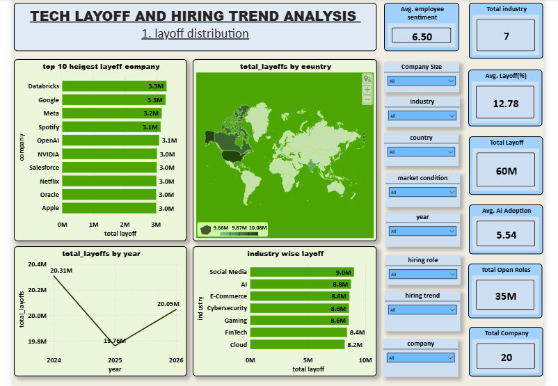
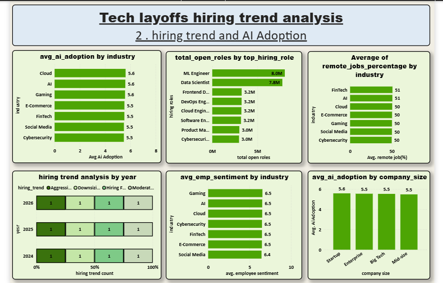

# Tech Layoffs & Hiring Trends Analysis

## Project Overview

This project is a data analytics portfolio project focused on understanding workforce movement in the global technology industry. It analyzes layoffs, hiring trends, AI adoption, employee sentiment, remote work, financial performance, and market conditions across major tech sectors.

The goal of this project is to identify how technology companies are balancing layoffs and hiring, how AI adoption is connected with workforce restructuring, and which industries, countries, and company profiles show higher workforce instability.

## Business Problem

The technology industry is experiencing rapid change due to AI automation, market uncertainty, cost optimization, and changing hiring priorities. Companies may reduce headcount in some areas while still hiring for AI, data, cloud, cybersecurity, and engineering roles.

This project answers questions such as:

- Which industries and countries are experiencing the highest layoffs?
- Which sectors are still hiring despite workforce reductions?
- How does AI adoption relate to layoffs, job security, and employee sentiment?
- Which roles are most in demand in the current tech market?
- How do market conditions affect layoffs, hiring, and salary budgets?
- Which company profiles show the highest workforce risk?

## Dataset

The dataset contains **12,000 workforce records** covering technology companies from **2024 to 2026**.

Key dataset fields include:

- Company information: `company_name`, `industry`, `country`, `company_size`
- Layoff metrics: `layoffs_count`, `layoff_percentage`, `reason_for_layoffs`
- Hiring metrics: `open_roles`, `hiring_trend`, `top_hiring_role`
- AI metrics: `ai_automation_impact`, `ai_replacement_risk`, `ai_adoption_level`
- Employee metrics: `employee_sentiment`, `job_security_score`
- Business metrics: `stock_growth_percent`, `revenue_growth_percent`, `salary_budget_change`
- Work model metrics: `remote_jobs_percentage`
- Market context: `market_condition`

## Project Workflow

1. **Data Collection**
   - Used `tech_layoffs_hiring_trends.csv` as the main dataset.

2. **Database Loading**
   - Loaded the CSV data into a MySQL database using `csv_to_mysql.py`.
   - Created the source table `tech_layoffs_hiring_trends`.

3. **Data Cleaning**
   - Connected Jupyter Notebook to MySQL.
   - Checked data shape, null values, duplicates, and column consistency.
   - Removed unnecessary fields such as `record_id`.
   - Cleaned whitespace from text columns.
   - Stored the cleaned data as a MySQL table named `clean_dataset`.

4. **Exploratory Data Analysis**
   - Performed detailed EDA using Python, Pandas, Matplotlib, and Seaborn.
   - Analyzed layoffs, hiring, AI adoption, employee sentiment, financial performance, and remote work.

5. **Dashboard Creation**
   - Built a Power BI dashboard for interactive reporting and portfolio presentation.

## Tools & Technologies Used

- **Python**
- **Pandas**
- **NumPy**
- **Matplotlib**
- **Seaborn**
- **SQLAlchemy**
- **MySQL**
- **Jupyter Notebook**
- **Power BI**

## Project Structure

```text
tech_layoffs_hiring_trends/
│
├── tech_layoffs_hiring_trends.csv
│   └── Main dataset used for analysis
│
├── csv_to_mysql.py
│   └── Python script to load CSV data into MySQL
│
├── data_clean.ipynb
│   └── Data cleaning and preprocessing notebook
│
├── EDA.ipynb
│   └── Exploratory data analysis notebook
│
├── hiring_trend_analysis.png
│   └── Exported hiring trend visualization
│
├── layoff_distribution.png
│   └── Exported layoff distribution visualization
│
├── tech_layoffs_hiring_trends_analysis.pbix
│   └── Power BI dashboard file
│
└── README.md
    └── Project documentation
```

## Analysis Performed

### 1. Dataset Overview

- Counted companies, industries, and countries represented in the data.
- Analyzed company size distribution.
- Identified industries contributing the largest share of workforce records.

### 2. Layoff Analysis

- Identified industries with the highest layoffs.
- Compared layoffs across countries and company sizes.
- Analyzed common reasons for layoffs such as AI automation, cost cutting, restructuring, overhiring correction, and market slowdown.
- Studied layoff behavior under different market conditions.
- Reviewed layoff trends over time.

### 3. Hiring Trend Analysis

- Identified industries with the highest number of open roles.
- Analyzed the most frequently hired roles.
- Compared hiring trends across industries and countries.
- Studied where hiring continues despite layoffs.

### 4. AI Adoption Analysis

- Compared AI adoption levels across industries.
- Studied the relationship between AI adoption and layoff percentage.
- Analyzed AI replacement risk by industry.
- Identified job roles associated with high-AI-adoption companies.
- Compared AI automation impact across company sizes.

### 5. Employee Sentiment Analysis

- Compared employee sentiment across industries.
- Identified industries with lower job security scores.
- Analyzed how layoffs affect employee sentiment and job security.
- Studied employee sentiment under different market conditions.

### 6. Financial Performance Analysis

- Analyzed revenue growth by industry.
- Studied the relationship between stock growth and open roles.
- Compared salary budget changes across industries.
- Checked whether negative revenue growth is associated with larger layoffs.

### 7. Remote Workforce Analysis

- Identified industries and countries with higher remote job percentages.
- Analyzed whether remote work percentage influences employee sentiment.
- Compared remote work availability across hiring trends.

### 8. Workforce Risk & Restructuring Analysis

- Identified industries showing high layoffs, high hiring, and high AI adoption together.
- Analyzed signs of workforce restructuring rather than simple workforce reduction.
- Identified company profiles with higher risk based on layoffs, sentiment, job security, and revenue growth.

## Key Dataset Insights

- The dataset includes records from industries such as **Social Media, E-Commerce, Cloud, Cybersecurity, Gaming, AI, and FinTech**.
- Countries represented include **Singapore, UK, USA, India, Canada, and Germany**.
- The data covers companies from **Startup, Mid-size, Enterprise, and Big Tech** segments.
- Top hiring roles include **ML Engineer, Data Scientist, Frontend Developer, DevOps Engineer, Software Engineer, Cloud Engineer, Cybersecurity Analyst, and Product Manager**.
- The analysis shows important relationships between AI adoption, automation impact, layoffs, employee sentiment, and job security.

## Visual Outputs

### Layoff Distribution



### Hiring Trend Analysis



## Power BI Dashboard

The Power BI dashboard is available in:

```text
tech_layoffs_hiring_trends_analysis.pbix
```

To view the dashboard:

1. Install **Power BI Desktop**.
2. Download or clone this repository.
3. Open `tech_layoffs_hiring_trends_analysis.pbix` in Power BI Desktop.
4. Interact with the dashboard filters, charts, and summary visuals.

## How to Run This Project

### 1. Clone the Repository

```bash
git clone <your-repository-url>
cd tech_layoffs_hiring_trends
```

### 2. Install Required Python Libraries

```bash
pip install pandas numpy matplotlib seaborn sqlalchemy mysql-connector-python
```

### 3. Set Up MySQL Database

Create a MySQL database:

```sql
CREATE DATABASE tech_layoffs_hiring_trends;
```

Update the MySQL credentials in `csv_to_mysql.py` and the notebooks according to your local setup:

```python
host="localhost"
user="root"
password="your_password"
database="tech_layoffs_hiring_trends"
```

### 4. Load CSV Data into MySQL

Run:

```bash
python csv_to_mysql.py
```

This script creates a MySQL table from the CSV file and inserts the dataset into the database.

### 5. Run Data Cleaning Notebook

Open and run:

```text
data_clean.ipynb
```

This notebook cleans the source table and creates the `clean_dataset` table.

### 6. Run EDA Notebook

Open and run:

```text
EDA.ipynb
```

This notebook performs the full exploratory data analysis.

### 7. Open Power BI Dashboard

Open:

```text
tech_layoffs_hiring_trends_analysis.pbix
```

Use Power BI Desktop to explore the final interactive dashboard.

## Skills Demonstrated

- Data cleaning and preprocessing
- MySQL database integration
- SQL-based data extraction
- Exploratory data analysis
- Business problem framing
- Data visualization
- Workforce analytics
- AI impact analysis
- Power BI dashboard development
- Portfolio-level project documentation

## Conclusion

This project provides a complete analytics workflow for studying technology workforce trends. It combines Python, SQL, and Power BI to move from raw data to cleaned tables, exploratory analysis, visual insights, and an interactive dashboard.

The project highlights how layoffs, hiring demand, AI adoption, market conditions, financial performance, and employee sentiment interact in the modern technology job market.

